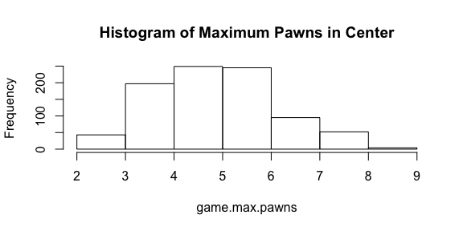

This is a vignette for the boardmakr package.

\vspace{12}

Contents: 

1)  Intro
2)  Workflow
    *  Downloading games
    *  Importing data to R
    *  Working with data
3) Sample Analysis: Knights vs. Bishops

\vspace{12}

## Intro: Chess analysis concepts

For any analysis of trends across chess games, standard notation will not suffice. To be able to characterize everything happening on a board, we need instantaneous data on all interactions between pieces on the board. That is, rather than thinking of the game as an unfolding process that happens move by move, we need to be able to examine each instant of the game knowing piece locations, so that we can determine who's under attack at any moment, what style of game is being played, and how decisions are made from move to move.

Representing games as series of board layouts allows each move to be treated as an independent decision based on the layout of the entire board, rather than considering each move independently. For example, standard PGN notation might show "Nxe4," which is useful only in that it tells us that a knight took a pawn. By looking at the board layout before and after this move, however, we can examine why that move was made: Who was under attack? How did the use of that knight to take that pawn change the layout of the board? Etc.

**Game representation using PGN:**
```{r echo = F}
cat('[Event "Paris"]
[Site "Paris FRA"]
[Date "1900.05.21"]
[EventDate "1900.??.??"]
[Round "3"]
[Result "0-1"]
[White "Frank James Marshall"]
[Black "David Janowski"]
[ECO "C45"]
[WhiteElo "?"]
[BlackElo "?"]
[PlyCount "108"]

1.e4 e5 2.Nf3 Nc6 3.d4 exd4 4.Bc4 Bc5 5.O-O d6 6.c3 d3 7.Qxd3
Nf6 8.e5 dxe5 9.Qxd8+ Kxd8 10.b4 Bb6 11.Ng5 Ke7 12.Nxf7 Rf8
13.b5 Rxf7 14.Ba3+ Ke8 15.bxc6 bxc6 16.Bxf7+ Kxf7 17.Nd2 Ba6
18.Rfe1 Re8 19.Ne4 Bd3 20.Nc5 Bb5 21.Rad1 Bc4 22.Nd7 e4 23.Bc5
Nd5 24.Bd4 Bxa2 25.Rd2 Bb3 26.Rb2 Ba4 27.Ne5+ Kg8 28.Ra1 Bb5
29.Bxb6 axb6 30.c4 Rxe5 31.cxb5 cxb5 32.Rxb5 Kf7 33.Rc1 Ke6
34.f4 exf3 35.gxf3 Kd6 36.Kf2 c5 37.Rb3 Kc6 38.Rcb1 Re7 39.f4
Rb7 40.f5 Rf7 41.Rf3 b5 42.Ke2 c4 43.Kd2 b4 44.Re1 Ra7 45.Re6+
Kc5 46.f6 Ra2+ 47.Kc1 gxf6 48.Rf5 b3 49.Re8 c3 50.Rc8+ Kd4
51.Rxd5+ Kxd5 52.Rxc3 Rc2+ 53.Rxc2 bxc2 54.Kxc2 Ke4 0-1')
```


### Example: Move 1

**PGN:**

We can see that the first move is **e4**. We know that this move indicates the central white pawn moving to board space e4.

**Board snapshot of move #1:**
```{r echo = FALSE}
before1 <- matrix(c("R1_w", "p1_w", "none", "none", "none", "none", "p1_b", "R1_b", "N1_w", "p2_w", "none", "none", "none","none", "p2_b", "N1_b", "B1_w", "p3_w", "none", "none", "none", "none", "p3_b", "B1_b", "Q_w",  "p4_w","none", "none", "none", "none", "p4_b", "Q_b",  "K_w",  "p5_w", "none", "none", "none", "none", "p5_b","K_b",  "B2_w", "p6_w", "none", "none", "none", "none", "p6_b", "B2_b", "N2_w", "p7_w", "none", "none","none", "none", "p7_b", "N2_b", "R2_w", "p8_w", "none", "none", "none", "none", "p8_b", "R2_b"),nrow=8,ncol = 8)
row.names(before1) <- 1:8
colnames(before1) <- letters[1:8]

after1 <-  matrix(c("R1_w", "p1_w", "none", "none", "none", "none", "p1_b", "R1_b", "N1_w", "p2_w", "none", "none", "none","none", "p2_b", "N1_b", "B1_w", "p3_w", "none", "none", "none", "none", "p3_b", "B1_b", "Q_w",  "p4_w","none", "none", "none", "none", "p4_b", "Q_b",  "K_w",  "none", "none", "p5_w", "none", "none", "p5_b","K_b",  "B2_w", "p6_w", "none", "none", "none", "none", "p6_b", "B2_b", "N2_w", "p7_w", "none", "none","none", "none", "p7_b", "N2_b", "R2_w", "p8_w", "none", "none", "none", "none", "p8_b", "R2_b"),nrow=8,ncol=8)
row.names(after1) <- 1:8
colnames(after1) <- letters[1:8]
cat("Move #1, by white:")
list(before1,after1)
```

Now we can see the same move, **e4**, in the context of the rest of the board.

### Example: Move 27

The advantage of being to examine each move individually is more apparent when considering a move in the middle of the game. 

**PGN:**

PGN offers no information other than **Ne5+**. 

*  This tells us that a knight moved to space e5 and put the black king in check. 

The same move represented by two board snapshots, in contrast, offers full context for the move.

**Board snapshot of move #27:**
```{r echo = FALSE}
before27 <- matrix(c("none", "none", "none", "B1_b", "none", "none", "p1_b", "none", "none", "R1_w", "none", "none",
"none", "B2_b", "none", "none", "none", "none", "p3_w", "none", "none", "p2_b", "p3_b", "none",
"none", "none", "none", "B1_w", "N2_b", "none", "N1_w", "none", "R2_w", "none", "none", "p4_b",
"none", "none", "none", "R1_b", "none", "p6_w", "none", "none", "none", "none", "K_b", "none",
"K_w",  "p7_w", "none", "none", "none", "none", "p7_b", "none", "none", "p8_w", "none", "none",
"none", "none", "p8_b", "none"),nrow=8,ncol=8)
row.names(before27) <- 1:8
colnames(before27) <- letters[1:8]

after27 <- matrix(c("none", "none", "none", "B1_b", "none", "none", "p1_b", "none", "none", "R1_w", "none", "none",
"none", "B2_b", "none", "none", "none", "none", "p3_w", "none", "none", "p2_b", "p3_b", "none",
"none", "none", "none", "B1_w", "N2_b", "none", "none", "none", "R2_w", "none", "none", "p4_b",
"N1_w", "none", "none", "R1_b", "none", "p6_w", "none", "none", "none", "none", "K_b",  "none",
"K_w",  "p7_w", "none", "none", "none", "none", "p7_b", "none", "none", "p8_w", "none", "none",
"none", "none", "p8_b", "none"),nrow=8,ncol=8)
row.names(after27) <- 1:8
colnames(after27) <- letters[1:8]

cat("Move #27, by white:")
list(before27,after27)
```

Here, we aren't losing any information -- we can still see that a knight moved to e5 and put the black king in check. But now we have the location of all pieces on the board, and we know exactly where the knight moved from to land on e5. We can examine the implications of this move in the context of other pieces on the board.

## Workflow

This package offers a foundation for conducting analysis of chess games. It supplies functions for downloading chess games from an online database and converting these games to a format useful for analysis in R.

### Downloading games

*  The data acquisition functions in this package scrape games from "chessgames.com," a chess game database that is designed to allow users to study individual games based on specific players, tournaments, opening styles, etc. (read more on chessgames.com at their ["about" page](http://www.chessgames.com/chessabout.html))
    *  `download_random_games()` 
        *  Downloads a user-specified number of random chess games straight from "chessgames.com" -- where they are saved as .txt files in PGN format -- to a user-specified **empty** directory.
    *  `download_games_id()` 
        *  Exists to download specific games from chessgames.com. The user supplies a vector of game IDs and a destination directory.

### Importing data to R

*  Cleaning data:
    *  `get_moves()`
        *  Trims the PGN text file and stores vectors of black and white moves. 
        *  Returned vectors of moves are in a format usable for `get_boards()`.

*  Producing games as collections of board snapshots:
    *  `get_boards()`
        * Takes cleaned PGN move vectors from `get_moves()` and produces a list of
            1) all board snapshots
            2) white move snapshot pairs
            3) black move snapshot pairs
        * `white_move()` and `black_move()`
            *  Internal functions for `get_boards`
            *  Contain rules for how to interpret each move in PGN notation

### Working with data

*  Functions in progress. Currently:
    *  `get_captures_by_partition()`
        *  Divides the game into "partitions" defined by how many of a specific piece remain on the board. If the specified piece is "bishop," for example, the game is partitioned based on when there are two bishops on the board, one bishop on the board, and no bishops on the board. The function returns the number of captures by each color during each partition.

# Analysis: Knights vs. Bishops

## Intro

In the classic method of assigning point values to pieces, knights and bishops are both assigned values of 3. More recently, the value of bishops tends to be adjusted to being just higher than that of knights, as most people consider bishops to be stronger pieces. 

## Counting the number of pieces captured by bishops vs. knights

A simple way to start is to take an average number of pieces taken by bishops across a lot of games and to compare that with the average number of pieces taken by knights.

```{r include = FALSE}
source("../R/get_moves.R") #use get_moves(__gametext__)
source("../R/white_move.R") #used within get_boards()
source("../R/black_move.R") #used within get_boards()
source("../R/get_boards.R")  #use get_boards(__moveslist__)
```
```{r eval = FALSE}
files <- list.files("../../data/games")
knight_caps <- integer(0)
bishop_caps <- integer(0)
queen_caps <- integer(0)
for (q in files[1:1000]) {
  tryCatch({

    
    firstfile <- q
    test <- readLines(paste0("../../data/games/",firstfile))
    mymoves <- get_moves(test)
    full_game <-get_boards(mymoves)
    
    
    # now we want all of the "moves" -- this captures all board transitions that involve two changing squares. 
    # this excludes castling.
    involved_spaces <- integer(0)
    for(i in 1:(length(full_game$boardpositions)-1)) { 
      move <- full_game$boardpositions[[i]][!(full_game$boardpositions[[i]] == full_game$boardpositions[[i+1]])]
      if (length(move) == 2) {
        involved_spaces <- rbind(involved_spaces,move)
      }
    }
    
    white <- involved_spaces[!(1:nrow(involved_spaces) %% 2 == 0),] # sorts out all white moves
    black <- involved_spaces[(1:nrow(involved_spaces) %% 2 == 0),] # sorts out all black moves
    
    whitecaptures <- white[-arrayInd(grep("none", white),dim(white))[,1],] #this sorts out all of the non-captures
    blackcaptures <- black[-arrayInd(grep("none", black),dim(black))[,1],]
    
    whiteknightcaptures <- rbind(whitecaptures[arrayInd(grep("N1_w", whitecaptures),dim(whitecaptures))[,1],],
                                 whitecaptures[arrayInd(grep("N2_w", whitecaptures),dim(whitecaptures))[,1],])
    whitebishopcaptures <- rbind(whitecaptures[arrayInd(grep("B1_w", whitecaptures),dim(whitecaptures))[,1],],
                                 whitecaptures[arrayInd(grep("B2_w", whitecaptures),dim(whitecaptures))[,1],])
    whitequeencaptures <- whitecaptures[arrayInd(grep("Q_w", whitecaptures),dim(whitecaptures))[,1],]
    
    blackknightcaptures <- rbind(blackcaptures[arrayInd(grep("N1_b", blackcaptures),dim(blackcaptures))[,1],],
                                 blackcaptures[arrayInd(grep("N2_b", blackcaptures),dim(blackcaptures))[,1],])
    blackbishopcaptures <- rbind(blackcaptures[arrayInd(grep("B1_b", blackcaptures),dim(blackcaptures))[,1],],
                                 blackcaptures[arrayInd(grep("B2_b", blackcaptures),dim(blackcaptures))[,1],])
    blackqueencaptures <- blackcaptures[arrayInd(grep("Q_b", blackcaptures),dim(blackcaptures))[,1],]    
    numknightcaptures <- nrow(whiteknightcaptures) + nrow(blackknightcaptures)
    numbishopcaptures <- nrow(whitebishopcaptures) + nrow(blackbishopcaptures)
    numqueencaptures <- nrow(whitequeencaptures) + nrow(blackqueencaptures)
    
    knight_caps <- c(knight_caps,numknightcaptures)
    bishop_caps <- c(bishop_caps,numbishopcaptures)
    queen_caps <- c(queen_caps,numqueencaptures)
    
  }, error=function(e){cat("ERROR :",conditionMessage(e), "\n")})
}
```
```{r include = FALSE}
files <- list.files("../../data/games")
knight_caps <- integer(0)
bishop_caps <- integer(0)
queen_caps <- integer(0)
length(files)
for (q in files[1:1000]) {
  tryCatch({

    
    firstfile <- q
    test <- readLines(paste0("../../data/games/",firstfile))
    mymoves <- get_moves(test)
    full_game <-get_boards(mymoves)
    
    
    # now we want all of the "moves" -- this captures all board transitions that involve two changing squares. 
    # this excludes castling.
    involved_spaces <- integer(0)
    for(i in 1:(length(full_game$boardpositions)-1)) { 
      move <- full_game$boardpositions[[i]][!(full_game$boardpositions[[i]] == full_game$boardpositions[[i+1]])]
      if (length(move) == 2) {
        involved_spaces <- rbind(involved_spaces,move)
      }
    }
    
    white <- involved_spaces[!(1:nrow(involved_spaces) %% 2 == 0),] # sorts out all white moves
    black <- involved_spaces[(1:nrow(involved_spaces) %% 2 == 0),] # sorts out all black moves
    
    whitecaptures <- white[-arrayInd(grep("none", white),dim(white))[,1],] #this sorts out all of the non-captures
    blackcaptures <- black[-arrayInd(grep("none", black),dim(black))[,1],]
    
    whiteknightcaptures <- rbind(whitecaptures[arrayInd(grep("N1_w", whitecaptures),dim(whitecaptures))[,1],],
                                 whitecaptures[arrayInd(grep("N2_w", whitecaptures),dim(whitecaptures))[,1],])
    whitebishopcaptures <- rbind(whitecaptures[arrayInd(grep("B1_w", whitecaptures),dim(whitecaptures))[,1],],
                                 whitecaptures[arrayInd(grep("B2_w", whitecaptures),dim(whitecaptures))[,1],])
    whitequeencaptures <- whitecaptures[arrayInd(grep("Q_w", whitecaptures),dim(whitecaptures))[,1],]
    
    blackknightcaptures <- rbind(blackcaptures[arrayInd(grep("N1_b", blackcaptures),dim(blackcaptures))[,1],],
                                 blackcaptures[arrayInd(grep("N2_b", blackcaptures),dim(blackcaptures))[,1],])
    blackbishopcaptures <- rbind(blackcaptures[arrayInd(grep("B1_b", blackcaptures),dim(blackcaptures))[,1],],
                                 blackcaptures[arrayInd(grep("B2_b", blackcaptures),dim(blackcaptures))[,1],])
    blackqueencaptures <- blackcaptures[arrayInd(grep("Q_b", blackcaptures),dim(blackcaptures))[,1],]    
    numknightcaptures <- nrow(whiteknightcaptures) + nrow(blackknightcaptures)
    numbishopcaptures <- nrow(whitebishopcaptures) + nrow(blackbishopcaptures)
    numqueencaptures <- nrow(whitequeencaptures) + nrow(blackqueencaptures)
    
    knight_caps <- c(knight_caps,numknightcaptures)
    bishop_caps <- c(bishop_caps,numbishopcaptures)
    queen_caps <- c(queen_caps,numqueencaptures)
    
  }, error=function(e){cat("ERROR :",conditionMessage(e), "\n")})
}
```
```{r}
mean(knight_caps)
mean(bishop_caps)
mean(queen_caps)
```

*  Notice that the queen captures fewer pieces on average, but remember that there is only one queen while there are two of each knights and bishops.

So we can see that, on average, bishops capture more pieces during these games than knights do.

This opens up all sorts of new questions...

1) Does this hold when different numbers of each knights and bishops are left on the board? Or might single knights perform better than single bishops? This might be tough to answer, given that each type of piece might exist as a "single" for different amounts of time, on average, and at different phases of the game.
2) Do knights tend to do better in closed games than in open games, as we might be led to believe from literature? If so, this might be an effect of the piece actually performing better, or it might be the effect of chess players using the pieces differently based on what mainstream chess theory teaches about using knights and bishops.
3) Are knights and bishops used differently depending on the skill of the player? What about the time in history?

## Partitioning games based on number of remaining knights / bishops

*  We would love to be able to estimate the average number of pieces captured when only one bishop or one knight is on the board, but this is biased -- such scenarios only exist toward the end of the game, when pieces might not be captured as frequently.
    *  We'll try fixing this by taking a proportion: The number of captures by a piece during a partition divided by the total number of captures during that partition. However, this seems like it might be easily skewed if, for example, the bishop is the only remaining piece to make captures toward the end of a game.
*  *Side note:* It might be easy and interesting to characterize the rate, generally, at which pieces are captured through games. Have "number of total pieces remaining" on the y-axis and "move" on the x-axis, and then divide by the total number of moves.

The functions below break the game up in three partitions for a designated piece: where two of that piece are surviving, where one is surviving, and where neither is surviving. They then calculate the proportion of captures made during each partition by the designated "capturing piece."
```{r}
get_captures_by_partition <- function(game,partitionpiece,capturingpiece = NULL) { #partitionpiece = single letter (like "B"). Refers to the piece for which you want to break captures apart by (if bishop, it'll be partitioned into "two,one, and no bishop captures")

allblackmoves <- game$black.moves
allwhitemoves <- game$white.moves

premove <- unlist(lapply(allblackmoves,head,n=1),recursive = FALSE)
premovebishops <- lapply(premove,grep,pattern=partitionpiece)
num.black <- integer(0)
for (i in 1:length(premove)) {
  survivingpieces <-premove[[i]][premovebishops[[i]]]
  temp.num.black <- length(grep("b",survivingpieces))
  num.black <- c(num.black,temp.num.black)
}
premove <- unlist(lapply(allwhitemoves,head,n=1),recursive = FALSE)
premovebishops <- lapply(premove,grep,pattern=partitionpiece)
num.white <- integer(0)
for (i in 1:length(premove)) {
  survivingpieces <-premove[[i]][premovebishops[[i]]]
  temp.num.white <- length(grep("w",survivingpieces))
  num.white <- c(num.white,temp.num.white)
}
#Now get captures per move
two.black <- allblackmoves[(num.black == 2)]
one.black <- allblackmoves[(num.black == 1)]
no.black <- allblackmoves[(num.black == 0)]
two.white <- allwhitemoves[(num.white == 2)]
one.white <- allwhitemoves[(num.white == 1)]
no.white <- allwhitemoves[(num.white == 0)]
nummoves.two.black <- length(two.black)
nummoves.one.black <- length(one.black)
nummoves.no.black <- length(no.black)
nummoves.two.white <- length(two.white)
nummoves.one.white <- length(one.white)
nummoves.no.white <- length(no.white)

get_involved_spaces <- function(x) { # retrieves the two spaces involved in each move
  if (length(x) > 0) {
    involved_spaces <- integer(0)
    for(i in 1:(length(x))) {
      move <- x[[i]][[1]][!(x[[i]][[1]] == x[[i]][[2]])]
      if (length(move) == 2) {
        involved_spaces <- rbind(involved_spaces,move)
      }
    }
    involved_spaces
  }
  else { NULL }
}

two.black.spaces <- get_involved_spaces(two.black) # the two spaces involved in each black move
one.black.spaces <- get_involved_spaces(one.black)
no.black.spaces <- get_involved_spaces(no.black)
two.white.spaces <- get_involved_spaces(two.white) # the two spaces involved in each white move
one.white.spaces <- get_involved_spaces(one.white)
no.white.spaces <- get_involved_spaces(no.white)

get_captures <- function(x) {    # returns moves that are captures
  if (is.null(x)) {return(NULL)}
  captures <- x[-arrayInd(grep("none", x),dim(x))[,1],]
  if (length(captures)==0) {     # if all moves are captures
    captures <- x
  }
  if (is.null(dim(captures))) {
    dim(captures) <- c(1,2)
    }
  return(captures)
}

two.black.captures <- get_captures(two.black.spaces)
one.black.captures <- get_captures(one.black.spaces)
no.black.captures <- get_captures(no.black.spaces)
two.white.captures <- get_captures(two.white.spaces)
one.white.captures <- get_captures(one.white.spaces)
no.white.captures <- get_captures(no.white.spaces)

captures <- list(twopieces_white=two.white.captures,twopieces_black=two.black.captures,onepieces_white=one.white.captures,onepieces_black=one.black.captures,nopieces_white=no.white.captures,nopieces_black = no.black.captures)
num.moves <- c(nummoves.two.white,nummoves.two.black,nummoves.one.white,nummoves.one.black,nummoves.no.white,nummoves.no.black)


if (!is.null(capturingpiece)) {
  possiblepieces <- c(paste0(capturingpiece,"1_w"),paste0(capturingpiece,"2_w"),paste0(capturingpiece,"1_b"),paste0(capturingpiece,"2_b"))
  if (!is.null(captures$twopieces_white)) {
    piececaptures_white_two <- rbind(captures$twopieces_white[arrayInd(grep(possiblepieces[1], captures$twopieces_white),dim(captures$twopieces_white))[,1],],
                                     captures$twopieces_white[arrayInd(grep(possiblepieces[2], captures$twopieces_white),dim(captures$twopieces_white))[,1],])
  } else {
    piececaptures_white_two <- NULL
    }
  if (!is.null(captures$twopieces_black)) {
    piececaptures_black_two <- rbind(captures$twopieces_black[arrayInd(grep(possiblepieces[3], captures$twopieces_black),dim(captures$twopieces_black))[,1],],
                                     captures$twopieces_black[arrayInd(grep(possiblepieces[4], captures$twopieces_black),dim(captures$twopieces_black))[,1],])
  } else {piececaptures_black_two <- NULL}
  if (!is.null(captures$onepieces_white)) {
    piececaptures_white_one <- rbind(captures$onepieces_white[arrayInd(grep(possiblepieces[1], captures$onepieces_white),dim(captures$onepieces_white))[,1],],
                                     captures$onepieces_white[arrayInd(grep(possiblepieces[2], captures$onepieces_white),dim(captures$onepieces_white))[,1],])
  } else {piececaptures_white_one <- NULL}
  if (!is.null(captures$onepieces_black)) {
    piececaptures_black_one <- rbind(captures$onepieces_black[arrayInd(grep(possiblepieces[3], captures$onepieces_black),dim(captures$onepieces_black))[,1],],
                                     captures$onepieces_black[arrayInd(grep(possiblepieces[4], captures$onepieces_black),dim(captures$onepieces_black))[,1],])
  } else {piececaptures_black_one <- NULL}
  if (!is.null(captures$nopieces_white)) {
    piececaptures_white_none <- rbind(captures$nopieces_white[arrayInd(grep(possiblepieces[1], captures$nopieces_white),dim(captures$nopieces_white))[,1],],
                                      captures$nopieces_white[arrayInd(grep(possiblepieces[2], captures$nopieces_white),dim(captures$nopieces_white))[,1],])
  } else {piececaptures_white_none <- NULL}
  if (!is.null(captures$nopieces_black)) {
    piececaptures_black_none <- rbind(captures$nopieces_black[arrayInd(grep(possiblepieces[3], captures$nopieces_black),dim(captures$nopieces_black))[,1],],
                                      captures$nopieces_black[arrayInd(grep(possiblepieces[4], captures$nopieces_black),dim(captures$nopieces_black))[,1],])
  } else {piececaptures_black_none <- NULL}
  if (!(length(piececaptures_white_two) > 0)) {piececaptures_white_two <- NULL}
  if (!(length(piececaptures_black_two) > 0)) {piececaptures_black_two <- NULL}
  if (!(length(piececaptures_white_one) > 0)) {piececaptures_white_one <- NULL}
  if (!(length(piececaptures_black_one) > 0)) {piececaptures_black_one <- NULL}
  if (!(length(piececaptures_white_none) > 0)) {piececaptures_white_none <- NULL}
  if (!(length(piececaptures_black_none) > 0)) {piececaptures_black_none <- NULL}
  captures <- list(twopieces_white=piececaptures_white_two,twopieces_black=piececaptures_black_two,onepieces_white=piececaptures_white_one,onepieces_black=piececaptures_black_one,nopieces_white=piececaptures_white_none,nopieces_black = piececaptures_black_none)
}
list(captures = captures, number_moves_partition = num.moves)
}
```

```{r proportion_captured_function}
proportion_captured_pieces_by_partition <- function(game, partitionpiece, capturingpiece) {
bishop_capture_partition <- get_captures_by_partition(game,partitionpiece,capturingpiece)
bishop_capture_partition_total <- get_captures_by_partition(game,partitionpiece)

twobishops <- nrow(rbind(bishop_capture_partition$captures$twopieces_black,bishop_capture_partition$captures$twopieces_white))
onebishop <- nrow(rbind(bishop_capture_partition$captures$onepieces_black,bishop_capture_partition$captures$onepieces_white))
twobishops_total <- nrow(rbind(bishop_capture_partition_total$captures$twopieces_black,bishop_capture_partition_total$captures$twopieces_white))
onebishop_total <- nrow(rbind(bishop_capture_partition_total$captures$onepieces_black,bishop_capture_partition_total$captures$onepieces_white))
if (!is.null(twobishops)) {
  bishopcaps_per_capture2 <- (twobishops/twobishops_total)
} else if (!is.null(twobishops_total)) {
  bishopcaps_per_capture2 <- 0
  } else {bishopcaps_per_capture2 <- NULL}
if (!is.null(onebishop)) {
  bishopcaps_per_capture1 <- (onebishop/onebishop_total)
} else if (!is.null(onebishop_total)) {
  bishopcaps_per_capture1 <- 0
  } else {bishopcaps_per_capture1 <- NULL}
list(piece_captures_per_capture_when_2 = bishopcaps_per_capture2,piece_captures_per_capture_when_1 = bishopcaps_per_capture1)
}
```

We can now apply this function to try to estimate whether bishops or knights make a higher proportion of captures (the proportion bit is meant to correct for different numbers of captures through different phases of the game) when both of the piece type are surviving or one of the piece type is surviving.
```{r eval = FALSE}
bishopscore2 <- integer(0)
bishopscore1 <- integer(0)
knightscore2 <- integer(0)
knightscore1 <- integer(0)
NBscore2 <- integer(0)
NBscore1 <- integer(0)
BNscore2 <- integer(0)
BNscore1 <- integer(0)
for (q in files[1:1000]) {
  
  tryCatch({
    
  firstfile <- q
  test <- readLines(paste0("../../data/games/",firstfile))
  mymoves <- get_moves(test)
  full_game <-get_boards(mymoves)
  bishops <- proportion_captured_pieces_by_partition(full_game,"B","B")
  knights <- proportion_captured_pieces_by_partition(full_game,"N","N")
  bishopscore2 <- c(bishopscore2, bishops[[1]])
  bishopscore1 <- c(bishopscore1, bishops[[2]])
  knightscore2 <- c(knightscore2, knights[[1]])
  knightscore1 <- c(knightscore1, knights[[2]])
  part_N_cap_B <- proportion_captured_pieces_by_partition(full_game,"N","B")
  part_B_cap_N <- proportion_captured_pieces_by_partition(full_game,"B","N")
  NBscore2 <- c(NBscore2, part_N_cap_B[[1]])
  NBscore1 <- c(NBscore1, part_N_cap_B[[2]])
  BNscore2 <- c(BNscore2, part_B_cap_N[[1]])
  BNscore1 <- c(BNscore1, part_B_cap_N[[2]])
  
  }, error=function(e){cat("ERROR :",conditionMessage(e), "\n")})
}
```
```{r include = FALSE}
bishopscore2 <- integer(0)
bishopscore1 <- integer(0)
knightscore2 <- integer(0)
knightscore1 <- integer(0)
NBscore2 <- integer(0)
NBscore1 <- integer(0)
BNscore2 <- integer(0)
BNscore1 <- integer(0)
for (q in files[1:1000]) {
  
  tryCatch({
    
  firstfile <- q
  test <- readLines(paste0("../../data/games/",firstfile))
  mymoves <- get_moves(test)
  full_game <-get_boards(mymoves)
  bishops <- proportion_captured_pieces_by_partition(full_game,"B","B")
  knights <- proportion_captured_pieces_by_partition(full_game,"N","N")
  bishopscore2 <- c(bishopscore2, bishops[[1]])
  bishopscore1 <- c(bishopscore1, bishops[[2]])
  knightscore2 <- c(knightscore2, knights[[1]])
  knightscore1 <- c(knightscore1, knights[[2]])
  part_N_cap_B <- proportion_captured_pieces_by_partition(full_game,"N","B")
  part_B_cap_N <- proportion_captured_pieces_by_partition(full_game,"B","N")
  NBscore2 <- c(NBscore2, part_N_cap_B[[1]])
  NBscore1 <- c(NBscore1, part_N_cap_B[[2]])
  BNscore2 <- c(BNscore2, part_B_cap_N[[1]])
  BNscore1 <- c(BNscore1, part_B_cap_N[[2]])
  
  }, error=function(e){cat("ERROR :",conditionMessage(e), "\n")})
}
```
```{r}
mean(bishopscore2) # prop of captures made by bishops when 2 are surviving
mean(knightscore2) # prop of captures made by knights when 2 are surviving
mean(bishopscore1) # prop of captures made by bishops when 1 is surviving
mean(knightscore1) # prop of captures made by knights when 1 is surviving
```

So we see that the knight scores are **higher** here! What does this mean?

*  Given that bishops take more pieces overall, the only way to explain the lower proportion of captures by bishops is that they exist longer in the game -- so that the denominator ("number of total captures by any pieces through this partition") is bigger.

Now let's test to confirm that bishops last longer through chess games. 

Here is the function that will count the number of a piece for each color for each move:
```{r}
count_number_of_piece_thru_game <- function(N_or_B_or_R) {
  letter <- N_or_B_or_R
  before_white_moves <- unlist(lapply(full_game$white.moves,head,1,1),recursive = FALSE)
  before_black_moves <- unlist(lapply(full_game$black.moves,head,1,1),recursive = FALSE)
  
  num1_w <- unlist(lapply(lapply(before_white_moves,grep,pattern=paste0(letter,"1_w")),length))
  num2_w <- unlist(lapply(lapply(before_white_moves,grep,pattern=paste0(letter,"2_w")),length))
  num.white.pieces <- num1_w + num2_w
  
  num1_b <- unlist(lapply(lapply(before_black_moves,grep,pattern=paste0(letter,"1_b")),length))
  num2_b <- unlist(lapply(lapply(before_black_moves,grep,pattern=paste0(letter,"2_b")),length))
  num.black.pieces <- num1_b + num2_b
  list(num.white.pieces = num.white.pieces,num.black.pieces=num.black.pieces)
}
```

And here is code that will allow us to directly compare the length of time before a bishop / knight is lost from either color ("early"), and then from the other color ("late"):
```{r eval = FALSE}
earlybishop <- latebishop <- earlyknight <- lateknight <- integer(0)
for (q in files[1:1000]) {
  
  tryCatch({
  
      firstfile <- q
      test <- readLines(paste0("../../data/games/",firstfile))
      mymoves <- get_moves(test)
      full_game <-get_boards(mymoves)
      
      
      numbishops <- count_number_of_piece_thru_game("B")
      numknights <- count_number_of_piece_thru_game("N")
      
      white.bish2 <- sum(numbishops$num.white.pieces == 2)/length(full_game$black.moves)
      black.bish2 <- sum(numbishops$num.black.pieces == 2)/length(full_game$black.moves)
      
      white.knight2 <- sum(numknights$num.white.pieces == 2)/length(full_game$black.moves)
      black.knight2 <- sum(numknights$num.black.pieces == 2)/length(full_game$black.moves)
      
      earlybishop <- c(earlybishop,min(c(white.bish2,black.bish2)))
      latebishop <- c(latebishop,max(c(white.bish2,black.bish2)))
      earlyknight <- c(earlyknight,min(c(white.knight2,black.knight2)))
      lateknight <- c(lateknight,max(c(white.knight2,black.knight2)))
      
  }, error=function(e){cat("ERROR :",conditionMessage(e), "\n")})
}
```
```{r include = FALSE}
earlybishop <- latebishop <- earlyknight <- lateknight <- integer(0)
for (q in files[1:1000]) {
  
  tryCatch({
  
      firstfile <- q
      test <- readLines(paste0("../../data/games/",firstfile))
      mymoves <- get_moves(test)
      full_game <-get_boards(mymoves)
      
      
      numbishops <- count_number_of_piece_thru_game("B")
      numknights <- count_number_of_piece_thru_game("N")
      
      white.bish2 <- sum(numbishops$num.white.pieces == 2)/length(full_game$black.moves)
      black.bish2 <- sum(numbishops$num.black.pieces == 2)/length(full_game$black.moves)
      
      white.knight2 <- sum(numknights$num.white.pieces == 2)/length(full_game$black.moves)
      black.knight2 <- sum(numknights$num.black.pieces == 2)/length(full_game$black.moves)
      
      earlybishop <- c(earlybishop,min(c(white.bish2,black.bish2)))
      latebishop <- c(latebishop,max(c(white.bish2,black.bish2)))
      earlyknight <- c(earlyknight,min(c(white.knight2,black.knight2)))
      lateknight <- c(lateknight,max(c(white.knight2,black.knight2)))
      
  }, error=function(e){cat("ERROR :",conditionMessage(e), "\n")})
}
```
```{r}
mean(earlybishop) # time for either color to lose its first bishop
mean(latebishop) # time for the other color to lose its first bishop
mean(earlyknight) # time for either color to lose its first knight
mean(lateknight) # time for the other color to lose its first knight
```

So we can see that bishops **do last longer before being taken** than knights.

## Open vs. Closed Games

First, we need to figure out how we're going to classify games as "open" or "closed." This generally refers to whether the center is crowded with pawns.

In the following code, I count the number of pawns in the middle of the board (rows 3:6, columns c:f) for 1000 games, and I take the maximum number of pawns in this space at any moment for each game.

```{r eval = FALSE}
game.max.pawns <- integer(0)
for (q in 1:1000) {
  tryCatch({
firstfile <- files[q]
test <- readLines(paste0("../../data/games/",firstfile))
mymoves <- get_moves(test)
full_game <-get_boards(mymoves)


pawn.locations <- lapply(full_game$boardpositions,grep,pattern = "p")
center.locations <- c(19:22,27:30,35:38,43:46) # rows 3:6, columns c:f
pawns <- integer(0)
for (i in 1:length(pawn.locations)) {
  pawns <- c(pawns,sum(pawn.locations[[i]] %in% center.locations))
  max.pawns <- max(pawns)
}
game.max.pawns <- c(game.max.pawns,max.pawns)

  }, error=function(e){cat("ERROR :",conditionMessage(e), "\n")})
}
```
```{r include = FALSE}
game.max.pawns <- integer(0)
for (q in 1:1000) {
  tryCatch({
firstfile <- files[q]
test <- readLines(paste0("../../data/games/",firstfile))
mymoves <- get_moves(test)
full_game <-get_boards(mymoves)


pawn.locations <- lapply(full_game$boardpositions,grep,pattern = "p")
center.locations <- c(19:22,27:30,35:38,43:46) # rows 3:6, columns c:f
pawns <- integer(0)
for (i in 1:length(pawn.locations)) {
  pawns <- c(pawns,sum(pawn.locations[[i]] %in% center.locations))
  max.pawns <- max(pawns)
}
game.max.pawns <- c(game.max.pawns,max.pawns)

  }, error=function(e){cat("ERROR :",conditionMessage(e), "\n")})
}
```
```{r echo=FALSE, out.width='100%'}

```

We can see that the maximum number of pawns in the middle of the board for most games is five or six. Given this, we'll define a "closed game" as a game that, at some point, includes as many as seven pawns in the center. 

*  A more inclusive way to classify closed games would be to lower this to six. This would offer more data, but it might reduce our "closed game" signal.
*  We might also want to consider the length of time that pawns occupy the center, but this is beyond the scope of this simple test.

Now we want to count the number of knight captures vs. bishop captures in what we define as closed games vs. open games.

*  We will do this by wrapping our knight vs. bishop capture script from the first test (now written as a function) in code that directs capture counts to the proper "open game" or "closed game" vector.

```{r}
count_knight_bishop_captures <- function(game) {
    # now we want all of the "moves" -- this captures all board transitions that involve two changing squares. 
    # this excludes castling.
    involved_spaces <- integer(0)
    for(i in 1:(length(game$boardpositions)-1)) { 
      move <- game$boardpositions[[i]][!(game$boardpositions[[i]] == game$boardpositions[[i+1]])]
      if (length(move) == 2) {
        involved_spaces <- rbind(involved_spaces,move)
      }
    }
    
    white <- involved_spaces[!(1:nrow(involved_spaces) %% 2 == 0),] # sorts out all white moves
    black <- involved_spaces[(1:nrow(involved_spaces) %% 2 == 0),] # sorts out all black moves
    
    whitecaptures <- white[-arrayInd(grep("none", white),dim(white))[,1],] #this sorts out all of the non-captures
    blackcaptures <- black[-arrayInd(grep("none", black),dim(black))[,1],]
    
    whiteknightcaptures <- rbind(whitecaptures[arrayInd(grep("N1_w", whitecaptures),dim(whitecaptures))[,1],],
                                 whitecaptures[arrayInd(grep("N2_w", whitecaptures),dim(whitecaptures))[,1],])
    whitebishopcaptures <- rbind(whitecaptures[arrayInd(grep("B1_w", whitecaptures),dim(whitecaptures))[,1],],
                                 whitecaptures[arrayInd(grep("B2_w", whitecaptures),dim(whitecaptures))[,1],])
    whitequeencaptures <- whitecaptures[arrayInd(grep("Q_w", whitecaptures),dim(whitecaptures))[,1],]
    
    blackknightcaptures <- rbind(blackcaptures[arrayInd(grep("N1_b", blackcaptures),dim(blackcaptures))[,1],],
                                 blackcaptures[arrayInd(grep("N2_b", blackcaptures),dim(blackcaptures))[,1],])
    blackbishopcaptures <- rbind(blackcaptures[arrayInd(grep("B1_b", blackcaptures),dim(blackcaptures))[,1],],
                                 blackcaptures[arrayInd(grep("B2_b", blackcaptures),dim(blackcaptures))[,1],])
    blackqueencaptures <- blackcaptures[arrayInd(grep("Q_b", blackcaptures),dim(blackcaptures))[,1],]    
    numknightcaptures <- nrow(whiteknightcaptures) + nrow(blackknightcaptures)
    numbishopcaptures <- nrow(whitebishopcaptures) + nrow(blackbishopcaptures)
    
    list(numbishopcaptures = numbishopcaptures,numknightcaptures = numknightcaptures)
}
```

```{r eval = FALSE}
closed_bishop_caps <- closed_knight_caps <- open_bishop_caps <- open_knight_caps <- integer(0)
for (q in 1:5000) {
  tryCatch({
    firstfile <- files[q]
    test <- readLines(paste0("../../data/games/",firstfile))
    mymoves <- get_moves(test)
    full_game <-get_boards(mymoves)
    caps <- count_knight_bishop_captures(full_game)
    
    pawn.locations <- lapply(full_game$boardpositions,grep,pattern = "p")
    center.locations <- c(19:22,27:30,35:38,43:46) # rows 3:6, columns c:f
    pawns <- integer(0)
    for (i in 1:length(pawn.locations)) {
      pawns <- c(pawns,sum(pawn.locations[[i]] %in% center.locations))
      max.pawns <- max(pawns)
    }
    
    if (max.pawns >= 7) {
      closed_bishop_caps <- c(closed_bishop_caps, caps$numbishopcaptures)
      closed_knight_caps <- c(closed_knight_caps, caps$numknightcaptures)
    }
    if (max.pawns < 7) {
      open_bishop_caps <- c(open_bishop_caps, caps$numbishopcaptures)
      open_knight_caps <- c(open_knight_caps, caps$numknightcaptures)
    }
}, error=function(e){cat("ERROR :",conditionMessage(e), "\n")})
}
```
```{r include = FALSE}
closed_bishop_caps <- closed_knight_caps <- open_bishop_caps <- open_knight_caps <- integer(0)
for (q in 1:5000) {
  tryCatch({
    firstfile <- files[q]
    test <- readLines(paste0("../../data/games/",firstfile))
    mymoves <- get_moves(test)
    full_game <-get_boards(mymoves)
    caps <- count_knight_bishop_captures(full_game)
    
    pawn.locations <- lapply(full_game$boardpositions,grep,pattern = "p")
    center.locations <- c(19:22,27:30,35:38,43:46) # rows 3:6, columns c:f
    pawns <- integer(0)
    for (i in 1:length(pawn.locations)) {
      pawns <- c(pawns,sum(pawn.locations[[i]] %in% center.locations))
      max.pawns <- max(pawns)
    }
    
    if (max.pawns >= 7) {
      closed_bishop_caps <- c(closed_bishop_caps, caps$numbishopcaptures)
      closed_knight_caps <- c(closed_knight_caps, caps$numknightcaptures)
    }
    if (max.pawns < 7) {
      open_bishop_caps <- c(open_bishop_caps, caps$numbishopcaptures)
      open_knight_caps <- c(open_knight_caps, caps$numknightcaptures)
    }
}, error=function(e){cat("ERROR :",conditionMessage(e), "\n")})
}
```
```{r}
mean(open_bishop_caps)
mean(closed_bishop_caps)
mean(open_knight_caps)
mean(closed_knight_caps)
```

So these results are unexpected. The absolute difference in numbers between open and closed games isn't necessarily surprising, but bishops outperforming knights by so much in closed games -- especially when considering the same comparison in open games, where bishops don't do very much better than knights -- is surprising.

*  Maybe this is a result of knights being taken earlier in closed games than in open games, so that their absolute count of "pieces taken" is misleading. Maybe it'd be better to represent this as "pieces taken per move that the piece exists." 
*  Also, perhaps this signals something I have yet to address: That "pieces captured" might not be the best way to represent the tactical advantage offered by a piece.